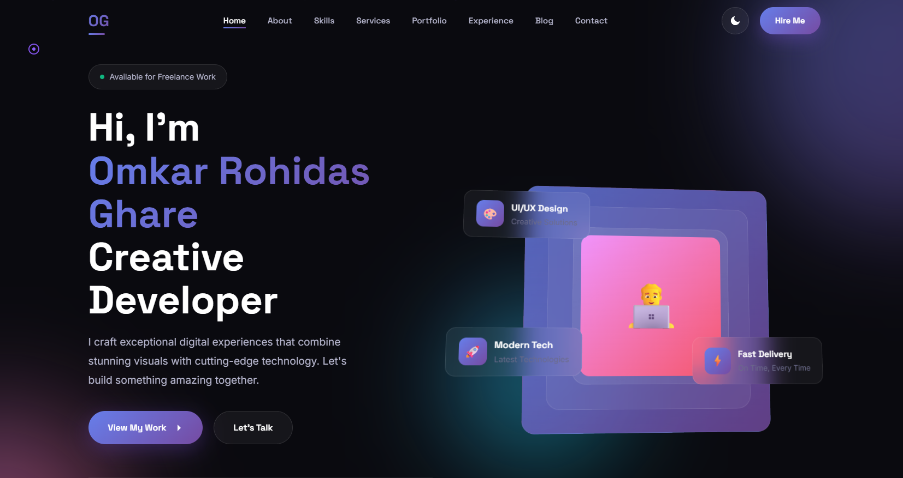

# ⚡ Personal Portfolio Website Template — V10

A premium-quality responsive portfolio website template built for developers, designers, freelancers, and digital creators.

This template combines modern UI design, smooth animations, and responsive layouts to create a professional online presence.

---

## ✨ Main Features

- Responsive Modern Design
- Elegant UI Components
- Smooth Animations
- Interactive Navigation
- Professional Portfolio Sections
- Optimized Performance
- Cross-Device Compatibility
- Organized Code Structure

---

## 🛠️ Technologies Used

- HTML5
- CSS3
- JavaScript

---

## 📸 Preview



---

## 📂 Project Structure

```bash
├── index.html
├── assets/
│   ├── css/
│   ├── js/
│   └── Images/
           └── Preview.png
```

---

## 🎯 Objective

To create a premium and modern portfolio template that helps showcase projects, skills, and creativity effectively.

---

## 👨‍💻 Developed By

**Omkar R. Ghare**

---

## 📜 License

Free to use for learning and personal portfolio projects.
